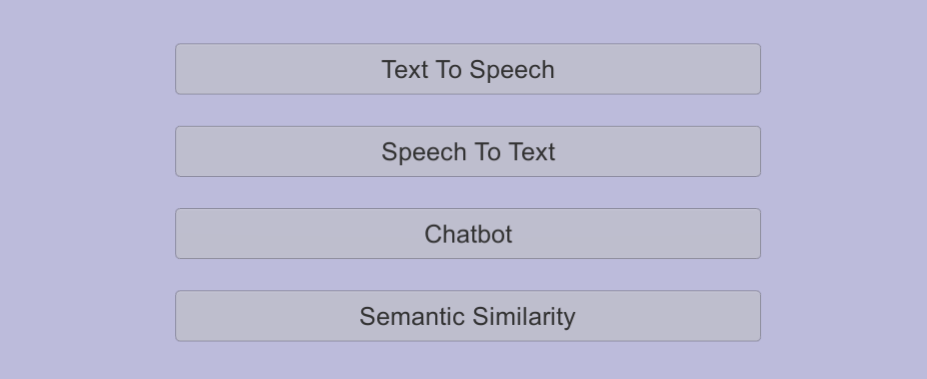
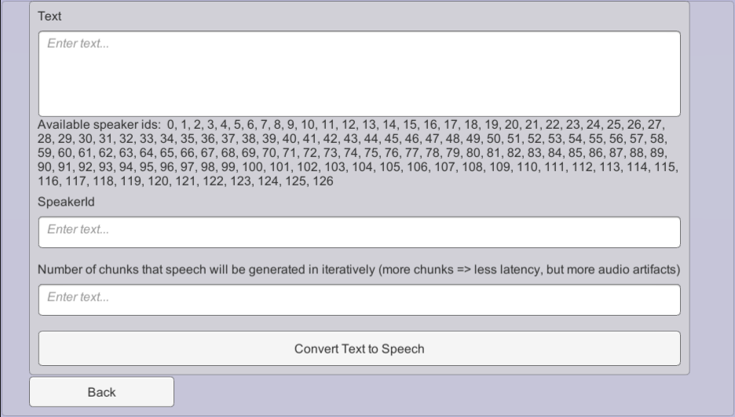
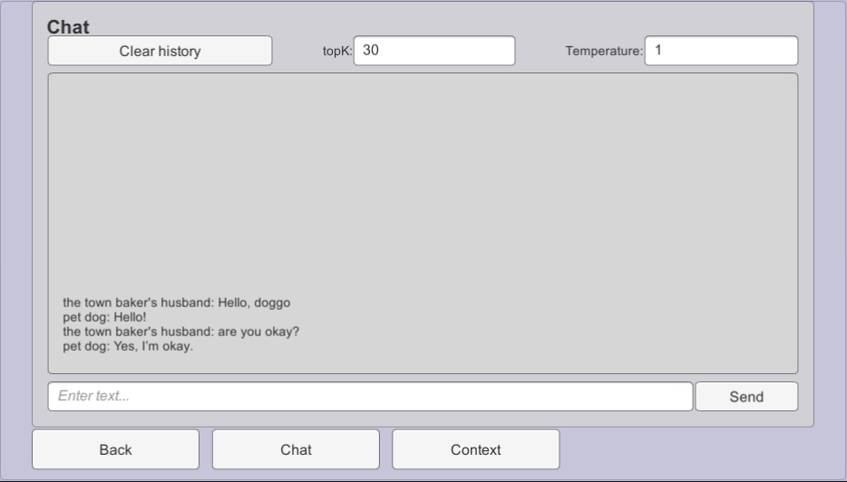

This tutorial explains raw usage of the NPC Engine API from Unity using Basic Demo scene.

## Scene Overview

First lets go through and play around with the basic demo scene.  
Its located under this path: `NPCEngine/Demo/BasicDemo/Basic.unity`

When you start it the first thing you'll see is this screen:


Buttons will be enabled almost immediately because NPC Engine process is started when the NPCEngineManager component is created. You don't have to worry about it most of the time, but keep in mind that when running game build it will take 10-30 seconds to start so make sure to e.g. add loading screens and wait until it's started.

## Available API Demos

### Text To Speech Demo

This demo shows you the API that allows you to generate speech from text with multiple voices.



### Using TTS in C#

You can see how TTS API is used in `Assets\NPCEngine\Demo\BasicDemo\Scripts\TextToSpeechCaller.cs`.

There are two coroutines to be called:

- First one is `TextToSpeechCaller.StartTTS` which takes a voice ID, text, number of chunks to generate speech in and a callback function that will be called when TTS is initialized. Note that there are no computations done in this function, it just creates required resources internally and returns immediately. 

All the parameters are self explanatory except the number of chunks:

Our TTS API is able to split the audio generated into parts and compute them sequentially, so that there is less latency during speech generation. The larger number of chunks means smaller latency, but the quality might suffer if chunks are too small. Good strategy is to select number of chunks based on the length of the text.

Depending on your hardware TTS solution might not be faster than realtime and would not produce next chunk in time to play it. In this case just pick 1 chunk and it will produce it in one go. 

```csharp
    StartCoroutine(
        NPCEngineManager.Instance.GetAPI<TextToSpeech>().StartTTS(
            speakerId.options[speakerId.value].text, 
            text.text, 
            Int32.Parse(nChunks.text), 
            () => { 
                PlaySoundAndStartNext();
            }
        )
    );
```

- Second one is `TextToSpeechCaller.PlaySoundAndStartNext`. It generates a part of speech audio and calls the callback function with a result as an argument.
When all the speech chunks were retrieved it will return an error with `StopIteration` in a message. 

```csharp
    StartCoroutine(
        NPCEngineManager.Instance.GetAPI<TextToSpeech>().GetNextResult(
            (result) =>
            {
                var clip = AudioClip.Create("tmp", result.Count, 1, 22050, false);
                clip.SetData(result.ToArray(), 0);
                audioQueue.PlaySound(clip);
                PlaySoundAndStartNext();
            }
        )
    );
```

Note how we use `audioQueue` to play the audio. It's a simple wrapper around Unity's `AudioSource` that allows us to play multiple audio clips in a row when previous is finished, so that if TTS produces audio faster than it can be played output is a smooth generated audio.

### Fantasy Chatbot Demo

This demo shows you the chatbot API. It enables you to describe a fantasy character via the chatbot context and chat with your character.

Right now it's available only in the single style (Fantasy) but we are already working on the other chatbot neural networks with different styles as well as tutorials how to train them yourself.

This demo greets you with a context in which you can fill in different descriptions to simulate different situations.


`Chat` button will take you to chat window where you can talk to the character defined in the context.



`Clear history` button will restart the dialogue.

### Using Chatbot in C#

You can see how Chatbot API is used in `Assets\NPCEngine\Demo\BasicDemo\Scripts\ChatbotCaller.cs`.

Each chatbot neural network will probably expect different context to be supplied.   

You can also create your own context and train your own chatbot neural network but it will be covered in the other tutorials. We have already provided a context for the default fantasy chatbot and defined it's API in `Assets\NPCEngine\Scripts\Components\ChatbotContexts\FantasyChatbotTextGeneration.cs`.

To generate chatbot replies you will have to populate the context in a similar way it's done in ChatbotCaller demo.


```csharp

    var context = new FantasyChatbotContext
    {
        location = Location.text,
        location_name = LocationName.text,
        name = Name.text,
        persona = Persona.text,
        other_name = OtherName.text,
        other_persona = OtherPersona.text,
        history = this.history
    };
```

Then you can call the coroutine for generating a reply. Result will appear in the callback. 

```csharp
    StartCoroutine(
        NPCEngineManager.Instance
        .GetAPI<FantasyChatbotTextGeneration>()
        .GenerateReply(
            context, 
            float.Parse(Temperature.text), 
            Int32.Parse(TopK.text), 
            Int32.Parse(NumBeams.text), 
            (result) =>
            {
                history.Add(new ChatLine { speaker = Name.text, line = result });
                RenderChat();
                SendButton.interactable = true;
            }
        )
    );
```

Important parameters are:

- Temperature - controls the randomness of the generated text. The higher the temperature the more random the text. 
- TopK - controls diversity. The higher the TopK the less probable tokens can appear in the text.
- Number of beams - api then generates multiple replies and selects the best one. The higher the number the better the reply but the slower the generation is.


### Semantic Similarity Demo

This demo shows the API to compare two sentences via their meaning.  
When you press `Compute Similarity` the score is shown in range of `[-1,1]`

Where -1 means that phrases are completely unrelated and 1 is that phrases are the same. Usually the most meaningful scores are in the range `[0,1]` 


### Using Semantic Similarity in C#

You can see how Semantic Similarity API is used in `Assets\NPCEngine\Demo\BasicDemo\Scripts\SemanticSimilarityCaller.cs`.

It is the simplest one to use, just call a coroutine:

```csharp
    StartCoroutine(
        NPCEngineManager.Instance
        .GetAPI<SemanticQuery>()
        .Compare(
            prompt1.text, 
            new List<string> { prompt2.text }, 
            (result) =>
            {
                outputLabel.text = result[0].ToString();
            }
        )
    );
```

All the sentences are cached so repeated calls with the same sentences will be much faster.

## Server Lifetime

Two most important NPC Engine classes are: 
- Script that manages NPC Engine core server `NPCEngine.Components.NPCEngineManager`.
- Script that contains configuration `NPCEngine.NPCEngineConfig`

They are attached to `NPCEngineManager` game object in the scene.  
NPC Engine core server's main purpose is to run inference services. 
Usually it is started automatically and you don't have to worry about it.

You can control what services to start in the configuration script.
You can also start or stop services via `Control` API
    
```csharp
    NPCEngineManager.Instance.GetAPI<Control>().StartService("exported-paraphrase-MiniLM-L6-v2");
    NPCEngineManager.Instance.GetAPI<Control>().StopService("exported-paraphrase-MiniLM-L6-v2");
```

Stopped services do not take up any resources (except the disk space).
Services configs will take effect on start/restart.
