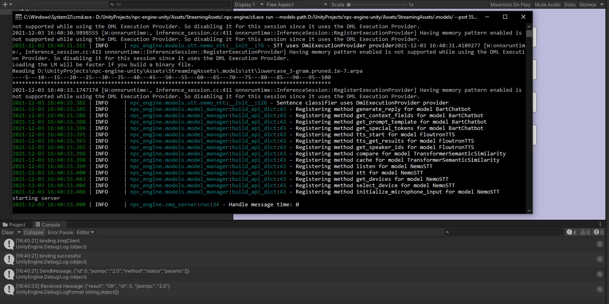
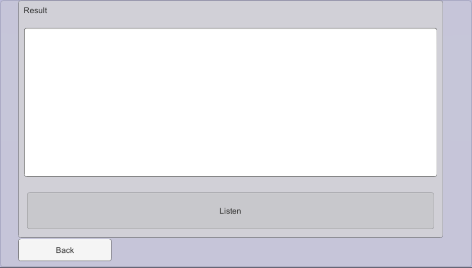
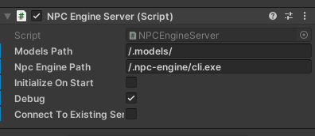

This tutorial explains raw usage of the NPC Engine API from Unity using Basic Demo scene.

## Scene Overview

First lets go through and play around with the basic demo scene.  
Its located under this path: `NPCEngine/Demo/BasicDemo/Basic.unity`

When you start it the first thing you'll see is this screen:

Since NPC Engine is a server that starts alongside unity and it's startup takes some time you can keep it running between playtests and just connect to existing one.  
No server is running so you should start a new one.

When started you should see some Unity logs regarding connecting to the server as well as server console pop up with server logs. This behaviour is debug only and can be turned off by disabling `debug` flag in `NPCEngineManager` game object.

If NPC Engine starts successfully, menu options will become interactable and you will be able to play around with different APIs.

## Available API Demos

### Text To Speech Demo

This demo shows you the API that allows you to generate speech from text with multiple voices.

### Fantasy Chatbot Demo

This demo shows you the chatbot API. It enables you to describe a fantasy character via the chatbot context and chat with your character.

Right now it's available only in the single style (Fantasy) but we are already working on the other chatbot neural networks with diffirent styles as well as tutorials how to train them yourself.

This demo greets you with a context in which you can fill in different descriptions to simulate different situations.

`Chat` button will take you to chat window where you can talk to the character defined in the context.

`Clear history` button will restart the dialogue.

### Semantic Similarity Demo

This demo shows the API to compare two sentences via their meaning.  
When you press `Compute Similarity` the score is shown in range of `[-1,1]`

Where -1 means that phrases are completely unrelated and 1 is that phrases are the same. Usually the most meaningful scores are in the range `[0,1]` 

### Speech To Text Demo

This demo shows you the API that allows you to listen to microphone input and 
transcribe it to text.

Just press `Listen` button and say something into the microphone.  
Note that it will only work in low noise environment and with slow articulate speech.

!!! note "Experimental API"
    This API is very WIP and experimental so it's performance is not yet ready
    for any production usage, you should use 
    [UnityEngine.Windows.Speech.DictationRecognizer](https://docs.unity3d.com/ScriptReference/Windows.Speech.DictationRecognizer.html) instead

## Server Lifetime

The main script that manages NPC Engine server is `NPCEngine.Server.NPCEngineServer`. It is attached to `NPCEngineManager` game object in the scene.

There you can find these public fields:

`Initialize On Start` controls whether NPCEngineServer will run `StartInferenceEngine` and `ConnectToServer` methods in it's `Awake` method.
For the basic demo it's turned off to allow you to start and connect to server manually via UI buttons.

`Debug` flag when turned on, starts server in a CMD window as well as enables `NPCEngineServer` to write message logs to console.
When it's off, server runs in the background with no logs produced.

`Connect To Existing Server` controls whether `NPCEngineServer` should start the server in `StartInferenceEngine` method
and take ownership of the process (check it's health and terminate it `OnDestroy`).
You can use this flag to not wait for NPCEngine to be initialized each playtest and keep connecting to the one that is already started.

