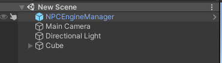
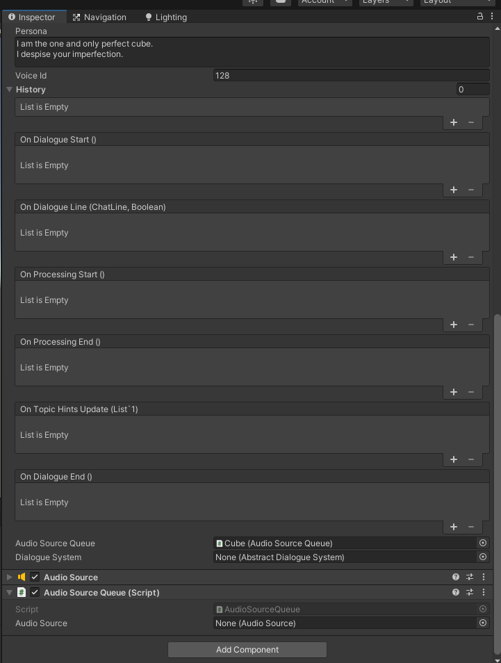
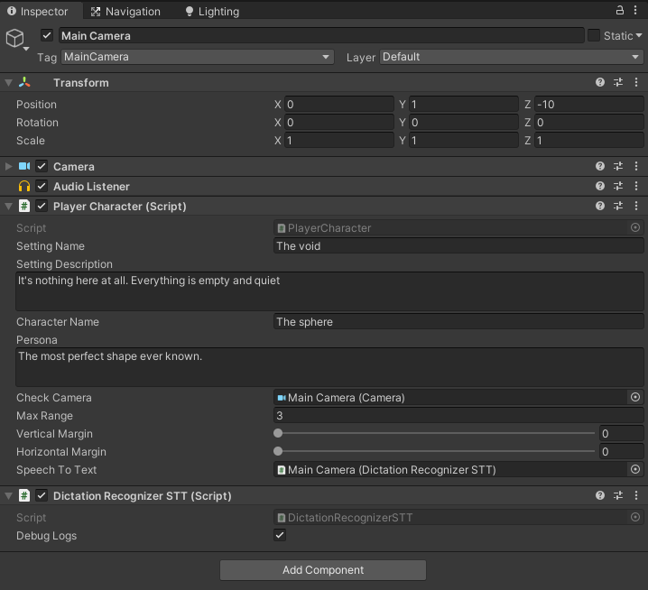
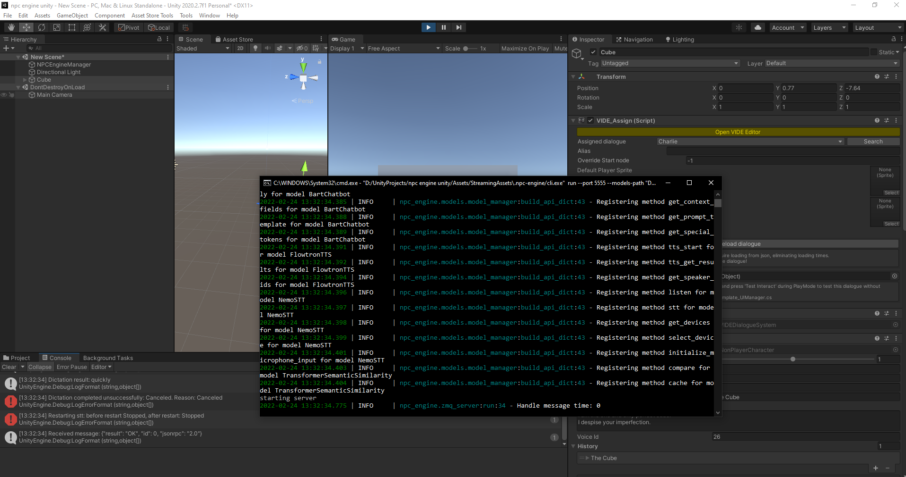

This tutorial will walk you through setting up a scene from zero.

## Server setup

- First, you have to make sure that npc-engine server is downloaded into the `Assets/StreamingAssets/.npc-engine` folder of your Unity project.  
- You should also have atleast one model in the `Assets/StreamingAssets/.models` folder.

This is usually done by the welcome dialogue buttons from the unity editor, but you can do it manually if required (see [Getting started](../index.md)).

It's best to test that everything is setup correctly in the basic demo scene first.

## Dependencies

One of the main dependency is some sort of a dialogue tree system. To integrate any dialogue system with npc-engine you must implement [AbstractDialogueSystem](../api/NPCEngine.Components.AbstractDialogueSystem.yml) interface. We already provide integration with a free dialogue tree system called [VIDE Dialogues](https://assetstore.unity.com/packages/tools/ai/vide-dialogues-69932) and we are going to use it in this tutorial.

## NPCEngineServer (NPCEngineManager prefab)

NPCEngineServer is a singleton component that manages the npc-engine server lifetime and communication, it is required in every scene that uses npc-engine.

It has a few useful properties that you can use to control how server is started, please refer to the [API](../api/NPCEngine.Server.NPCEngineServer.yml) for more details.

**It's missing on the screenshots but please add it anyway :) Bellow is the screenshot how final scene hierarchy should look**

## Character setup

In this section we will walk you through setting up a character in the scene.

First let's add a character to the scene, we'll call him `cube`.

The main npc-engine component for NPCs is [NonPlayerCharacter](../api/NPCEngine.Components.NonPlayerCharacter.yml), but if you will try adding it to the cube you will get an error that it requires AbstractDialogueSystem component that is abstract and cannot be instantiated.  
  
Lets first add VIDEDialogueSystem component to the cube. It will also create VIDE_Assign component that will assign the cube to the dialogue tree. Please refer to [VIDE documentation](https://videdialogues.wordpress.com/about/) for more details.  
  
After that you can add NonPlayerCharacter component to the cube.

Now, let's give our character a name, description and pick him a voice. 

Lets also add a dialogue tree for our character, NonPlayerCharacter will trigger speech recognition only if there is a players choice node active, otherwise player's speech will only trigger NPC speech generation with given static lines from the NPC dialogue nodes.

Lets just choose a random dialogue tree from the list of available ones.

We also should create an [AudioSourceQueue](../api/NPCEngine.Utility.AudioSourceQueue.yml) component and add it to the NonPlayerCharacter.

This is the basics of setting up a non-player character in the scene without the UI except the generated audio. We will go over the UI in the [NonPlayerCharacter Callbacks for UI](#nonplayercharacter-callbacks-for-ui) section.
  
You can read about all the other NonPlayerCharacter parameters in the [API docs](../api/NPCEngine.Components.NonPlayerCharacter.yml). 

## Player Character

Now it's time to set up the player character. Since there is no need for the player controller in this tutorial, we will just use a static Camera object.

First, let's add a [PlayerCharacter](../api/NPCEngine.Components.PlayerCharacter.yml) component to the camera object.

Except the familiar character name and persona parameters you might have noticed, there are a two more natural language parameters that you need to set: setting name and description. These describe the location of the character in the world for chatbot to use in the dialogue with the player. The reason it is not present in the NonPlayerCharacter component is that it is not a part of the NPC's state, but rather a property of the dialogue, so it is provided by the player character.

They are static in this tutorial, but they can be changed dynamically through scripts (e.g. as an event of collider trigger.)

The next important parameter is the SpeechToText component, it is used to convert speech from the microphone to text. We recommend using [DictationRecognizerSTT](../api/NPCEngine.Components.DictationRecognizerSTT.yml) component for this purpose, but it requires a change to windows settings (Dictation permision in speech privacy settings in Settings->Privacy->Speech, inking & typing), please refer to the [documentation](../api/NPCEngine.Components.DictationRecognizerSTT.yml) for details 

At this point you should be able to talk to your character by saying something in the microphone. It's time to **test it**!

**Make sure that our Cube NPC audio source is centered in the camera (It is checked to start a dialogue) and that it's closer than MaxRange parameter in Player Character component.**

On start you should see console pop up if your NPCEngineServer has `Debug` flag enabled. This is the console of the npc-engine server. It contains a lot of useful information about the server messaging and what models are loaded. If the console shows errors please check [Troubleshooting](#troubleshooting) section or create a [github issue](https://github.com/npc-engine/npc-engine/issues/new/choose).
Before you say anything you should click on unity Game window so that it enters focus and make sure that the microphone is enabled. Focus is required by Windows STT services.

After npc-engine intialization (Can be checked by NPCEngineServer.Instance.initialized flag), when you say something into your microphone you should see `hypothesis` and `result` logs in Unity console, as well as server logs showing messaging between npc-engine server and Unity.

You should also hear Cube's replies to your speech.

Here is how it should look like after start

STT Restart errors will appear every time you change focus from the game window as STT fails at that point and is restarted when you focus on the game window again.

## Troubleshooting

- TODO :) (post issues on github)

## NonPlayerCharacter Callbacks for UI

This section will explain how to setup UI for the NonPlayerCharacter.

The main idea is that NonPlayerCharacter updates any of your UI scripts via callbacks. You can also access dialogue history via the history parameter.

Here are the callbacks available:

We are mostly interested in:

- OnDialogueStart callback.  
It is triggered when the dialogue starts and usually should enable the UI object.

- OnDialogueEnd callback.  
Opposite of the dialogue start.

- OnDialogueLine callback.  
It is triggered when the dialogue history is updated. It contains the current line struct with text and name of the character as well as a boolean flag that becomes true when the line is scripted in the dialogue tree (false if it was generated).

- OnTopicHintsUpdate callback.  
Topic hints are the short phrases that describe dialogue options that player has. They can be shown to the player instead of actual phrases. Please see [Dialogue design section of advanced demo](advanced_demo.md#dialogue-design-considerations) for more details.

You could write your own scripts but we will use already [existing simple UI prefab](../api/NPCEngine.Components.DialogueUI.yml) we provide under  `NPCEngine/Demo/AdvancedDemo/Prefabs/DialogueUI.asset`.

Here is the example simple setup of the UI:

And here is the final result:  
